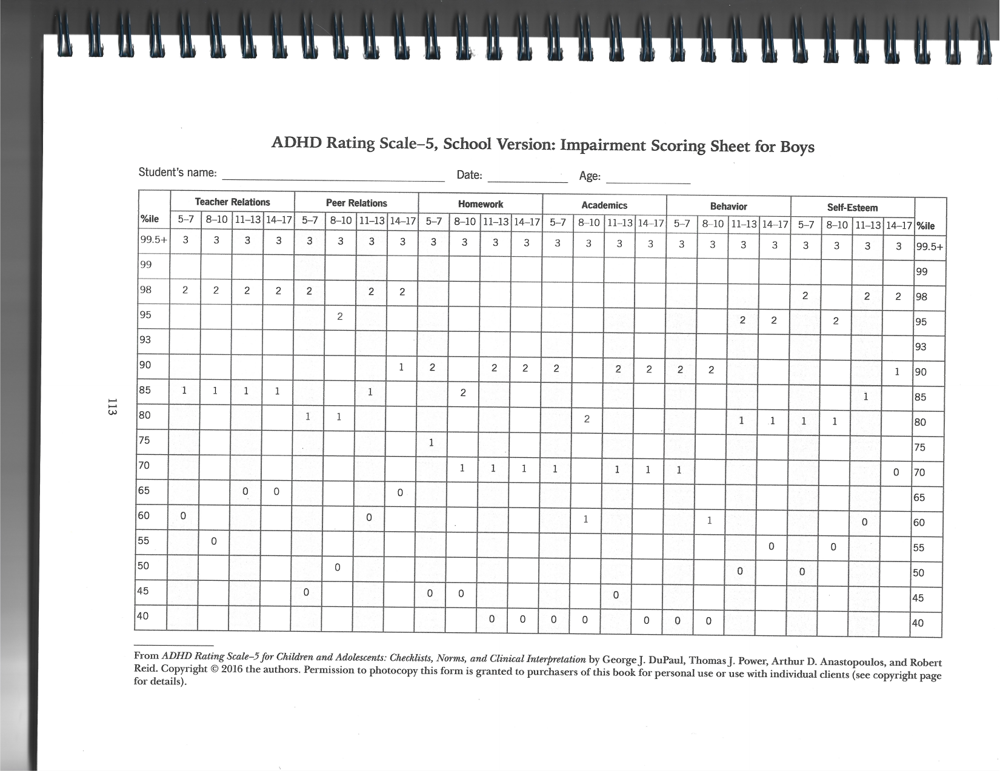
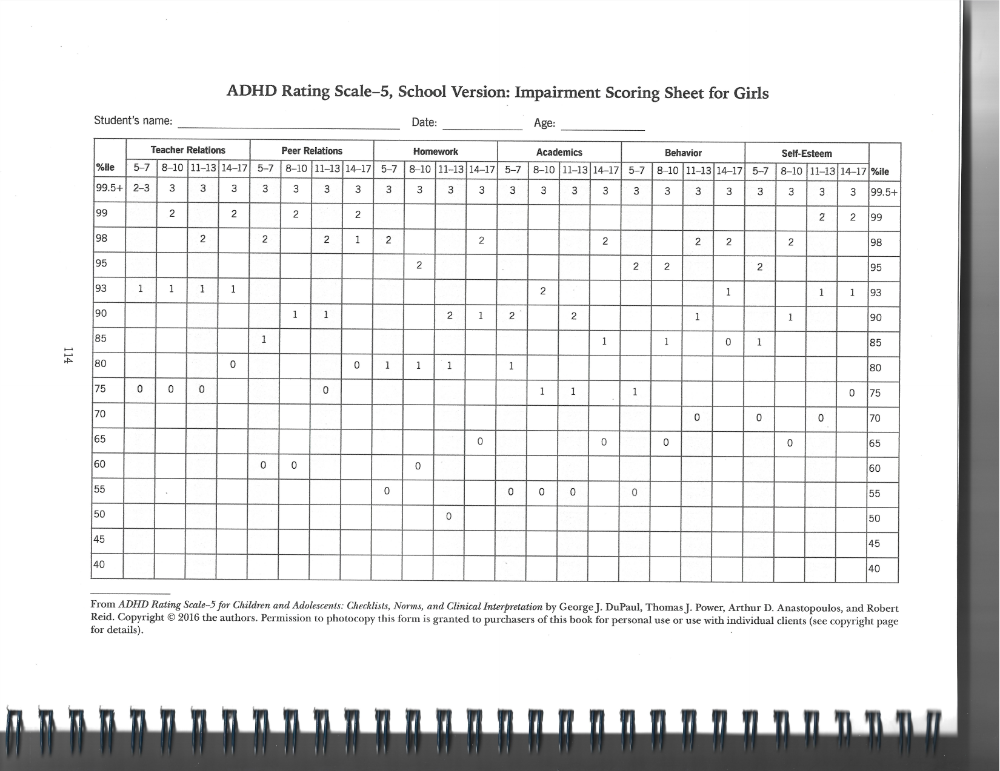

# ADHD-RS-5 School Version Norms

Parsed from `/Users/anderschan/Downloads/drive-download-20260409T210620Z-3-001/ADHD-RS Norms School.pdf` on 2026-04-09.

## Extraction Notes

- The source PDF is image-based.
- Pages 1 and 2 were transcribed into markdown tables.
- Pages 3 and 4 are sparse impairment percentile lookup sheets. To avoid OCR drift, they are preserved as embedded page images instead of forced text transcription.
- Source page titles:
  - Page 1: `ADHD Rating Scale-5, School Version: Symptom Scoring Sheet for Boys`
  - Page 2: `ADHD Rating Scale-5, School Version: Symptom Scoring Sheet for Girls`
  - Page 3: `ADHD Rating Scale-5, School Version: Impairment Scoring Sheet for Boys`
  - Page 4: `ADHD Rating Scale-5, School Version: Impairment Scoring Sheet for Girls`

## Page 1: Symptom Scoring Sheet for Boys

| %ile | HI 5-7 | HI 8-10 | HI 11-13 | HI 14-17 | IA 5-7 | IA 8-10 | IA 11-13 | IA 14-17 | Total 5-7 | Total 8-10 | Total 11-13 | Total 14-17 |
| --- | ---: | ---: | ---: | ---: | ---: | ---: | ---: | ---: | ---: | ---: | ---: | ---: |
| 99+ | 27 | 27 | 26 | 27 | 27 | 27 | 27 | 27 | 50 | 54 | 52 | 54 |
| 99 | 27 | 27 | 24 | 26 | 27 | 27 | 27 | 27 | 50 | 54 | 50 | 53 |
| 98 | 26 | 26 | 23 | 23 | 27 | 27 | 27 | 27 | 48 | 50 | 46 | 44 |
| 97 | 25 | 23 | 22 | 19 | 26 | 27 | 26 | 24 | 45 | 48 | 45 | 39 |
| 96 | 24 | 22 | 21 | 17 | 25 | 26 | 25 | 22 | 43 | 44 | 41 | 37 |
| 95 | 23 | 22 | 19 | 16 | 25 | 26 | 25 | 21 | 42 | 44 | 39 | 35 |
| 94 | 21 | 21 | 19 | 14 | 24 | 24 | 25 | 21 | 42 | 42 | 38 | 32 |
| 93 | 20 | 20 | 18 | 14 | 22 | 24 | 24 | 20 | 40 | 40 | 38 | 31 |
| 92 | 19 | 19 | 18 | 13 | 22 | 24 | 24 | 20 | 39 | 39 | 37 | 30 |
| 91 | 18 | 19 | 17 | 13 | 21 | 23 | 23 | 19 | 38 | 38 | 36 | 29 |
| 90 | 18 | 18 | 16 | 12 | 20 | 22 | 23 | 18 | 38 | 36 | 35 | 27 |
| 89 | 18 | 17 | 15 | 12 | 20 | 22 | 22 | 17 | 37 | 36 | 33 | 26 |
| 88 | 18 | 17 | 15 | 11 | 20 | 20 | 21 | 16 | 36 | 35 | 33 | 25 |
| 87 | 17 | 16 | 14 | 11 | 20 | 19 | 21 | 16 | 35 | 35 | 32 | 25 |
| 86 | 17 | 16 | 14 | 10 | 18 | 19 | 20 | 15 | 34 | 34 | 32 | 25 |
| 85 | 17 | 16 | 13 | 10 | 18 | 19 | 20 | 15 | 33 | 33 | 31 | 24 |
| 84 | 17 | 15 | 13 | 10 | 18 | 18 | 19 | 15 | 32 | 32 | 30 | 23 |
| 80 | 14 | 14 | 10 | 8 | 17 | 18 | 18 | 13 | 30 | 30 | 29 | 20 |
| 75 | 13 | 12 | 9 | 6 | 14 | 16 | 15 | 12 | 26 | 27 | 25 | 18 |
| 50 | 6 | 5 | 3 | 1 | 9 | 9 | 8 | 6 | 14 | 15 | 12 | 8 |
| 25 | 1 | 0 | 0 | 0 | 2 | 2 | 2 | 1 | 5 | 3 | 3 | 2 |
| 10 | 0 | 0 | 0 | 0 | 0 | 0 | 0 | 0 | 1 | 0 | 0 | 0 |
| 1 | 0 | 0 | 0 | 0 | 0 | 0 | 0 | 0 | 0 | 0 | 0 | 0 |

## Page 2: Symptom Scoring Sheet for Girls

| %ile | HI 5-7 | HI 8-10 | HI 11-13 | HI 14-17 | IA 5-7 | IA 8-10 | IA 11-13 | IA 14-17 | Total 5-7 | Total 8-10 | Total 11-13 | Total 14-17 |
| --- | ---: | ---: | ---: | ---: | ---: | ---: | ---: | ---: | ---: | ---: | ---: | ---: |
| 99+ | 24 | 23 | 27 | 26 | 24 | 27 | 27 | 27 | 45 | 48 | 53 | 52 |
| 99 | 24 | 20 | 23 | 21 | 24 | 26 | 26 | 27 | 45 | 41 | 46 | 46 |
| 98 | 21 | 18 | 18 | 15 | 23 | 24 | 25 | 25 | 43 | 40 | 41 | 33 |
| 97 | 20 | 18 | 15 | 13 | 23 | 23 | 24 | 20 | 42 | 37 | 38 | 31 |
| 96 | 19 | 15 | 13 | 12 | 22 | 21 | 23 | 18 | 38 | 35 | 33 | 29 |
| 95 | 17 | 15 | 13 | 10 | 20 | 20 | 22 | 16 | 36 | 33 | 31 | 25 |
| 94 | 16 | 15 | 12 | 9 | 19 | 19 | 22 | 15 | 33 | 31 | 30 | 23 |
| 93 | 15 | 14 | 11 | 9 | 18 | 19 | 21 | 14 | 33 | 31 | 29 | 22 |
| 92 | 15 | 13 | 11 | 9 | 18 | 18 | 20 | 14 | 31 | 30 | 28 | 21 |
| 91 | 14 | 13 | 10 | 8 | 17 | 18 | 19 | 13 | 30 | 29 | 27 | 20 |
| 90 | 14 | 13 | 9 | 7 | 17 | 18 | 18 | 12 | 30 | 28 | 26 | 19 |
| 89 | 14 | 11 | 9 | 6 | 17 | 17 | 17 | 11 | 29 | 27 | 25 | 18 |
| 88 | 14 | 11 | 9 | 6 | 16 | 17 | 16 | 11 | 29 | 25 | 25 | 16 |
| 87 | 14 | 10 | 9 | 5 | 16 | 17 | 16 | 11 | 28 | 24 | 23 | 16 |
| 86 | 13 | 10 | 9 | 5 | 16 | 16 | 15 | 10 | 27 | 24 | 22 | 14 |
| 85 | 12 | 9 | 8 | 5 | 15 | 15 | 14 | 10 | 26 | 23 | 22 | 14 |
| 84 | 11 | 9 | 8 | 5 | 15 | 15 | 14 | 9 | 26 | 22 | 21 | 14 |
| 80 | 9 | 7 | 6 | 3 | 13 | 12 | 12 | 8 | 22 | 20 | 18 | 11 |
| 75 | 8 | 6 | 4 | 2 | 11 | 11 | 10 | 7 | 18 | 17 | 15 | 9 |
| 50 | 2 | 2 | 1 | 0 | 3 | 5 | 3 | 2 | 6 | 7 | 5 | 3 |
| 25 | 0 | 0 | 0 | 0 | 0 | 0 | 0 | 0 | 1 | 1 | 1 | 0 |
| 10 | 0 | 0 | 0 | 0 | 0 | 0 | 0 | 0 | 0 | 0 | 0 | 0 |
| 1 | 0 | 0 | 0 | 0 | 0 | 0 | 0 | 0 | 0 | 0 | 0 | 0 |

Note: `HI = Hyperactivity-Impulsivity`, `IA = Inattention`.

## Page 3: Impairment Scoring Sheet for Boys

This page is a sparse percentile lookup grid across:

- School Professionals
- Other Students
- Homework
- Academics
- Behavior
- Self-Esteem

Each domain is broken out by age bands:

- `5-7`
- `8-10`
- `11-13`
- `14-17`

The original page image is preserved below for exact lookup:

## Page 4: Impairment Scoring Sheet for Girls

This page is a sparse percentile lookup grid across:

- School Professionals
- Other Students
- Homework
- Academics
- Behavior
- Self-Esteem

Each domain is broken out by age bands:

- `5-7`
- `8-10`
- `11-13`
- `14-17`

The original page image is preserved below for exact lookup:

## Copyright / Source Note

Source footer on the scanned pages:

`From ADHD Rating Scale-5 for Children and Adolescents: Checklists, Norms, and Clinical Interpretation by George J. DuPaul, Thomas J. Power, Arthur D. Anastopoulos, and Robert Reid. Copyright © 2016 the authors.`
