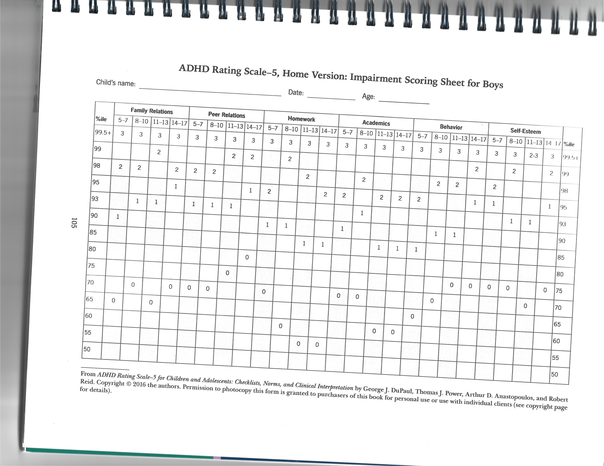
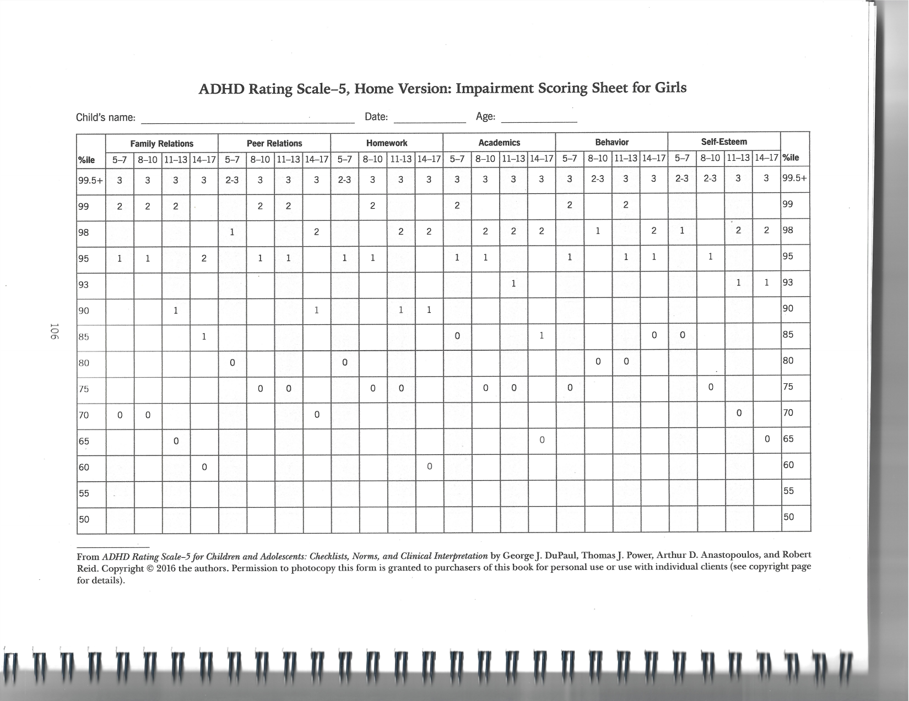

# ADHD-RS-5 Home Version Norms

Parsed from `/Users/anderschan/Downloads/ADHD-RS Norms.pdf` on 2026-04-09.

## Extraction Notes

- The PDF is image-based, not text-based.
- Pages 1 and 2 were transcribed into markdown tables.
- Pages 3 and 4 are sparse impairment percentile lookup tables. To avoid introducing OCR errors, they are preserved below as embedded page images instead of forced text transcription.
- Source page titles:
  - Page 1: `ADHD Rating Scale-5, Home Version: Symptom Scoring Sheet for Boys`
  - Page 2: `ADHD Rating Scale-5, Home Version: Symptom Scoring Sheet for Girls`
  - Page 3: `ADHD Rating Scale-5, Home Version: Impairment Scoring Sheet for Boys`
  - Page 4: `ADHD Rating Scale-5, Home Version: Impairment Scoring Sheet for Girls`

## Page 1: Symptom Scoring Sheet for Boys

| %ile | HI 5-7 | HI 8-10 | HI 11-13 | HI 14-17 | IA 5-7 | IA 8-10 | IA 11-13 | IA 14-17 | Total 5-7 | Total 8-10 | Total 11-13 | Total 14-17 |
| --- | ---: | ---: | ---: | ---: | ---: | ---: | ---: | ---: | ---: | ---: | ---: | ---: |
| 99+ | 27 | 27 | 26 | 21 | 27 | 27 | 27 | 27 | 50 | 53 | 52 | 47 |
| 99 | 24 | 26 | 22 | 16 | 25 | 27 | 27 | 26 | 45 | 49 | 47 | 39 |
| 98 | 19 | 20 | 19 | 15 | 23 | 25 | 27 | 25 | 41 | 44 | 43 | 37 |
| 97 | 18 | 20 | 18 | 13 | 22 | 21 | 25 | 21 | 38 | 38 | 38 | 34 |
| 96 | 17 | 19 | 17 | 12 | 21 | 20 | 22 | 20 | 38 | 36 | 36 | 30 |
| 95 | 17 | 18 | 15 | 10 | 18 | 17 | 21 | 19 | 35 | 35 | 34 | 27 |
| 94 | 17 | 17 | 14 | 9 | 17 | 16 | 21 | 18 | 32 | 33 | 31 | 26 |
| 93 | 17 | 16 | 13 | 9 | 17 | 16 | 19 | 18 | 31 | 31 | 30 | 25 |
| 92 | 16 | 16 | 12 | 9 | 16 | 16 | 18 | 17 | 29 | 30 | 28 | 25 |
| 91 | 15 | 15 | 11 | 8 | 15 | 15 | 18 | 16 | 27 | 29 | 26 | 22 |
| 90 | 15 | 14 | 10 | 8 | 14 | 14 | 17 | 16 | 27 | 28 | 25 | 21 |
| 89 | 13 | 13 | 10 | 7 | 14 | 12 | 16 | 15 | 26 | 25 | 24 | 20 |
| 88 | 13 | 11 | 9 | 7 | 12 | 12 | 15 | 14 | 25 | 24 | 23 | 19 |
| 87 | 12 | 10 | 9 | 6 | 11 | 12 | 15 | 13 | 24 | 22 | 22 | 18 |
| 86 | 12 | 10 | 9 | 5 | 11 | 11 | 15 | 12 | 22 | 21 | 22 | 18 |
| 85 | 10 | 9 | 9 | 5 | 10 | 11 | 14 | 11 | 20 | 19 | 21 | 17 |
| 84 | 10 | 9 | 9 | 5 | 10 | 11 | 13 | 11 | 20 | 19 | 21 | 16 |
| 80 | 9 | 8 | 7 | 4 | 9 | 9 | 12 | 10 | 18 | 17 | 19 | 14 |
| 75 | 8 | 7 | 6 | 3 | 9 | 9 | 10 | 9 | 16 | 14 | 17 | 11 |
| 50 | 5 | 3 | 2 | 1 | 5 | 4 | 6 | 4 | 10 | 8 | 8 | 5 |
| 25 | 2 | 1 | 0 | 0 | 2 | 2 | 1 | 1 | 4 | 3 | 2 | 2 |
| 10 | 0 | 0 | 0 | 0 | 0 | 0 | 0 | 0 | 0 | 1 | 0 | 0 |
| 1 | 0 | 0 | 0 | 0 | 0 | 0 | 0 | 0 | 0 | 0 | 0 | 0 |

Note: `HI = Hyperactivity-Impulsivity`, `IA = Inattention`.

## Page 2: Symptom Scoring Sheet for Girls

| %ile | HI 5-7 | HI 8-10 | HI 11-13 | HI 14-17 | IA 5-7 | IA 8-10 | IA 11-13 | IA 14-17 | Total 5-7 | Total 8-10 | Total 11-13 | Total 14-17 |
| --- | ---: | ---: | ---: | ---: | ---: | ---: | ---: | ---: | ---: | ---: | ---: | ---: |
| 99+ | 27 | 26 | 22 | 20 | 26 | 27 | 27 | 25 | 50 | 53 | 38 | 42 |
| 99 | 25 | 23 | 16 | 19 | 23 | 26 | 25 | 23 | 45 | 47 | 35 | 36 |
| 98 | 20 | 21 | 15 | 12 | 21 | 22 | 21 | 19 | 43 | 37 | 32 | 32 |
| 97 | 17 | 15 | 14 | 11 | 18 | 18 | 20 | 18 | 35 | 36 | 29 | 28 |
| 96 | 16 | 13 | 13 | 9 | 17 | 17 | 19 | 18 | 32 | 30 | 29 | 25 |
| 95 | 15 | 11 | 12 | 9 | 16 | 16 | 17 | 18 | 29 | 28 | 27 | 24 |
| 94 | 14 | 10 | 12 | 8 | 15 | 15 | 15 | 17 | 27 | 25 | 24 | 23 |
| 93 | 13 | 9 | 11 | 8 | 14 | 14 | 15 | 17 | 25 | 21 | 23 | 21 |
| 92 | 12 | 9 | 9 | 7 | 13 | 13 | 13 | 15 | 24 | 21 | 22 | 20 |
| 91 | 12 | 9 | 9 | 6 | 13 | 13 | 13 | 14 | 22 | 20 | 21 | 20 |
| 90 | 11 | 9 | 8 | 6 | 12 | 12 | 12 | 14 | 21 | 20 | 20 | 19 |
| 89 | 10 | 8 | 8 | 6 | 12 | 12 | 12 | 13 | 21 | 18 | 19 | 18 |
| 88 | 9 | 8 | 7 | 5 | 12 | 11 | 11 | 13 | 20 | 18 | 18 | 18 |
| 87 | 9 | 8 | 7 | 5 | 12 | 11 | 11 | 12 | 18 | 17 | 18 | 17 |
| 86 | 8 | 7 | 7 | 5 | 11 | 11 | 10 | 12 | 18 | 17 | 18 | 16 |
| 85 | 8 | 7 | 6 | 4 | 10 | 10 | 10 | 11 | 18 | 16 | 17 | 15 |
| 84 | 8 | 7 | 6 | 4 | 10 | 10 | 10 | 11 | 17 | 16 | 16 | 15 |
| 80 | 7 | 6 | 5 | 3 | 9 | 9 | 9 | 9 | 15 | 14 | 13 | 12 |
| 75 | 6 | 5 | 4 | 3 | 8 | 8 | 8 | 7 | 13 | 12 | 11 | 10 |
| 50 | 3 | 2 | 1 | 1 | 3 | 3 | 3 | 3 | 7 | 6 | 5 | 4 |
| 25 | 1 | 0 | 0 | 0 | 1 | 1 | 1 | 0 | 3 | 2 | 1 | 1 |
| 10 | 0 | 0 | 0 | 0 | 0 | 0 | 0 | 0 | 0 | 0 | 0 | 0 |
| 1 | 0 | 0 | 0 | 0 | 0 | 0 | 0 | 0 | 0 | 0 | 0 | 0 |

Note: `HI = Hyperactivity-Impulsivity`, `IA = Inattention`.

## Page 3: Impairment Scoring Sheet for Boys

This page is a sparse percentile lookup grid across:

- Family Relations
- Peer Relations
- Homework
- Academics
- Behavior
- Self-Esteem

Each domain is broken out by age bands:

- `5-7`
- `8-10`
- `11-13`
- `14-17`

The original page image is preserved below for exact lookup:

## Page 4: Impairment Scoring Sheet for Girls

This page is a sparse percentile lookup grid across:

- Family Relations
- Peer Relations
- Homework
- Academics
- Behavior
- Self-Esteem

Each domain is broken out by age bands:

- `5-7`
- `8-10`
- `11-13`
- `14-17`

The original page image is preserved below for exact lookup:

## Copyright / Source Note

Source footer on the scanned pages:

`From ADHD Rating Scale-5 for Children and Adolescents: Checklists, Norms, and Clinical Interpretation by George J. DuPaul, Thomas J. Power, Arthur D. Anastopoulos, and Robert Reid. Copyright © 2016 the authors.`
